# Evaluation Engine

The Evaluation Engine is the core component of the KUDE platform. 

> **⚠️ Disclaimer**: This is a Proof of Concept (PoC) program developed as part of a master thesis titled "KUDE - an evaluation platform for distributed systems". It is intended for research and educational purposes and may not be suitable for production environments without further development and testing.

## 🚀 Overview

The Evaluation Engine is the core component of the KUDE platform designed to:
- **Evaluate distributed computing tasks** using Akka or Spark frameworks
- **Monitor evaluation progress** in real-time with a web-based dashboard
- **Manage Git repositories** for automated code evaluation
- **Track performance metrics** and generate detailed reports
- **Handle plagiarism detection** using JPlag integration
- **Scale dynamically** on Kubernetes infrastructure

## 🏗️ Architecture

### KUDE Platform Overview

The KUDE platform is designed as a distributed system running on Kubernetes with dedicated master and worker nodes:

```mermaid
graph TB
    subgraph "Master Nodes (role=master)"
        subgraph "Administrative Components"
            EE[Evaluation Engine<br/>🎯 Main Application]
            GRAF[Grafana<br/>📊 Dashboards]
            LOKI[Loki<br/>📝 Log Aggregation]
            PROM[Prometheus<br/>📈 Metrics]
        end
    end

    subgraph "Worker Nodes (role=worker)"
        subgraph "Node 1"
            FB1[Fluent-bit<br/>DaemonSet]
            DM1[Data Manager<br/>📁 Dataset Sync]
            LA1[Log Analyzer<br/>🔍 Error Detection]
            subgraph "Evaluation Jobs"
                AKKA1[Akka Job<br/>⚡ Actor System]
                SPARK1[Spark Job<br/>🚀 Data Processing]
            end
        end

        subgraph "Node 2"
            FB2[Fluent-bit<br/>DaemonSet]
            DM2[Data Manager<br/>📁 Dataset Sync]
            LA2[Log Analyzer<br/>🔍 Error Detection]
            subgraph "Evaluation Jobs"
                AKKA2[Akka Job<br/>⚡ Actor System]
                SPARK2[Spark Job<br/>🚀 Data Processing]
            end
        end
    end

    EE -.->|Deploy via Helm| AKKA1
    EE -.->|Deploy via Helm| SPARK1
    EE -.->|Deploy via Helm| AKKA2
    EE -.->|Deploy via Helm| SPARK2

    FB1 -->|Logs| LOKI
    FB2 -->|Logs| LOKI
    LA1 -->|Events| EE
    LA2 -->|Events| EE
    DM1 -.->|Dataset Status| EE
    DM2 -.->|Dataset Status| EE

    PROM -->|Metrics| GRAF
    LOKI -->|Logs| GRAF

    style EE fill:#e1f5fe
    style AKKA1 fill:#f3e5f5
    style AKKA2 fill:#f3e5f5
    style SPARK1 fill:#fff3e0
    style SPARK2 fill:#fff3e0
```



### Core Components

- **Evaluation Engine**: Main orchestration service running on master nodes
- **Administrative Stack**: Grafana, Loki, and Prometheus for monitoring and observability
- **Worker Services**:
  - **Data-Manager**: Synchronizes datasets across worker nodes (see [dockerfiles repository](https://github.com/kude-platform/dockerfiles))
  - **Log-Analyzer**: Monitors local logs for predefined error patterns (see [dockerfiles repository](https://github.com/kude-platform/dockerfiles))
  - **Fluent-bit**: Log collection daemon running on all worker nodes

### Evaluation Job Deployment

- Evaluation jobs are deployed using Helm charts from `./helm/ddm-akka/`
- Docker images are built from definitions in the [dockerfiles repository](https://github.com/kude-platform/dockerfiles)
- Each evaluation task creates isolated workloads on worker nodes

### Supported Frameworks

- **Akka**: Actor-based distributed computing
- **Spark**: Large-scale data processing engine

## 📋 Prerequisites

- **Java 21+**
- **Kubernetes cluster** (for distributed execution)
- **Helm 3.x** (for deployment)
- **Git** (for repository management)
- **Docker** (for containerization)

## 🔗 Related Repositories

This evaluation engine is part of the broader KUDE platform ecosystem in the [kude-platform](https://github.com/kude-platform) organization. Related repositories provide infrastructure, templates, and testing capabilities:

### Core Infrastructure
- **[kude-platform/ansible](https://github.com/kude-platform/ansible)** - Infrastructure-as-Code for KUDE platform deployment
  - Kubernetes cluster provisioning and configuration
  - Monitoring stack setup (Prometheus, Loki, Fluent-bit)
  - Multi-machine deployment automation
- **[kude-platform/dockerfiles](https://github.com/kude-platform/dockerfiles)** - Docker images and build configurations
  - Evaluation Engine Dockerfile: [`images-master/evaluation-engine/Dockerfile`](https://github.com/kude-platform/dockerfiles/blob/main/images-master/evaluation-engine/Dockerfile)
  - Container definitions for evaluation workloads

### Test Repositories & Templates
The KUDE platform organization contains additional repositories with test code, template projects, and evaluation scenarios for various distributed computing frameworks. 
These may include performance benchmarks, error testing scenarios, and educational examples for Akka and Spark workloads.
Some of those repositories are private. 

## ⚙️ Installation & Setup

### 1. Clone the Repository
```bash
git clone https://github.com/kude-platform/evaluation-engine.git
cd evaluation-engine
```

### 2. Build the Application
```bash
./gradlew clean build
```

### 3. Configure Environment
Set required environment variables:
```bash
export EVALUATION_ENGINE_HOST=your-evaluation-engine-host
export NODES_RESERVED_FOR_SYSTEM=master-node-count-that-should-not-be-used-for-evaluation
export PROMETHEUS_HOST=your-prometheus-host:port
export GRAFANA_HOST=your-grafana-host:port
```

### 4. Deploy to Kubernetes

For production deployment to Kubernetes, use the automated deployment scripts and the helm chart inside the [ansible repository](https://github.com/kude-platform/ansible):

```bash
# Clone the deployment repository
git clone https://github.com/kude-platform/ansible.git
cd ansible
# Follow the deployment instructions in the ansible repository
```

### 5. Helm Charts for Evaluation Jobs

The `./helm` directory contains Helm charts used by the Evaluation Engine to dynamically deploy individual evaluation jobs (Akka/Spark workloads) to Kubernetes:

- **`./helm/ddm-akka/`** - Helm chart template for deploying Akka-based evaluation jobs
- These charts are used internally by the `KubernetesService` to create job-specific deployments
- Each submitted evaluation task triggers the deployment of a new Helm release using these templates
- The charts are **not** used to deploy the Evaluation Engine application itself; the helm chart for the application resides in the [ansible repository](https://github.com/kude-platform/ansible)

### 6. Access the Application
- **Web Interface**: http://your-host:8080/app/evaluation
- **REST API**: http://your-host:8080/api

## 🖥️ Usage

### Web Interface

The application provides several views:

1. **Evaluation View**: Submit and monitor evaluation tasks
2. **Dataset View**: Manage evaluation datasets
3. **Settings View**: Configure system parameters
4. **Graph View**: Visualize evaluation metrics
5. **Plagiarism View**: Run plagiarism detection analyses

### REST API Endpoints

#### Evaluation Management
- `GET /api/evaluation/anyEvaluationRunning` - Check if evaluations are running
- `GET /api/evaluation/allPodsReadyToRun/{id}` - Check pod readiness

#### Event Ingestion
- `POST /ingest/event` - Submit evaluation events
- `POST /ingest/file` - Upload evaluation files

#### Data Management
- `GET /api/data/datasets` - List available datasets
- `POST /api/data/datasets` - Create new dataset

## 🔍 Plagiarism Detection

Built-in JPlag integration supports:
- **Java source code** analysis
- **Text document** comparison
- **Configurable similarity** thresholds
- **Detailed reports** with similarity scores

## 🗂️ File System Integration

- **Temporary file management** in `/tmp/kude-tmp/`
- **Result export** to CSV format
- **Log file** archival and retrieval
- **Dataset storage** and management

## 🔄 Development

### Project Structure
```
src/main/java/com/github/kudeplatform/evaluationengine/
├── api/           # REST controllers and DTOs
├── async/         # Asynchronous evaluation components
├── config/        # Spring configuration classes
├── domain/        # Core business entities
├── mapper/        # Entity-DTO mappers
├── persistence/   # JPA entities and repositories
├── service/       # Business logic services
├── util/          # Utility classes
└── view/          # Vaadin UI components
```

### Key Services
- **EvaluationService**: Main evaluation service
- **KubernetesService**: Kubernetes cluster management
- **SettingsService**: Configuration management
- **DataManagerService**: Data synchronization
- **PlagiarismService**: Code similarity detection

### Building and Testing
```bash
# Run tests
./gradlew test

# Build JAR
./gradlew bootJar

# Run application locally
./gradlew bootRun
```

## 📜 License

This project is licensed under the terms specified in the [LICENSE](LICENSE) file.